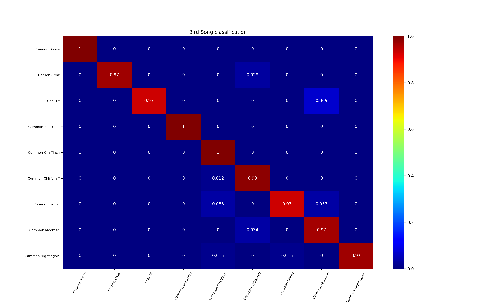

# Bird-Song-Classification

We want to classify different birds species given their audio samples. We have extracted spectrograms of the audio samples and used them as features for classification. We can use the [British Birdsong Dataset](https://www.kaggle.com/rtatman/british-birdsong-dataset) available on Kaggle for this experiment.

Siamese Networks along with dilated 1D convolutions are used here to classify 9 different bird species.

