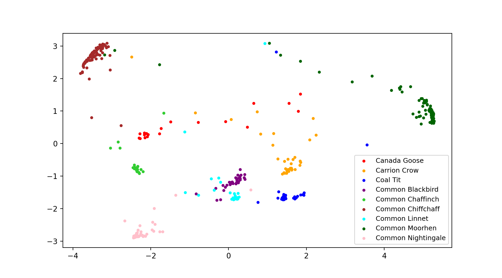

# Bird-Song-Classification

### The goal is to classify different birds species based on their songs/calls. Spectrograms have been extracted from the audio samples and used as features for classification. A Siamese network based on 1D dilated convolutions is used here. Model is trained using triplet loss. I am using the [British Birdsong Dataset](https://www.kaggle.com/rtatman/british-birdsong-dataset) available on Kaggle for this experiment.

Download the data from [here](https://www.kaggle.com/rtatman/british-birdsong-dataset). This dataset is a subset of [Xeno-Canto database](https://www.xeno-canto.org/).
Siamese Networks along with dilated 1D convolutions are used here to classify 9 different bird species.

Confusion Matrix of testset: 

Scatter plot of embeddings after applying PCA: 

Note: If you are having this error: AttributeError: module 'keras.utils.generic_utils' has no attribute 'populate_dict_with_module_objects'.  
Type: 
pip uninstall tf-nightly  
pip uninstall tf-estimate-nightly  
pip install tensorflow --upgrade --force-reinstall  

